# Chapter 1: Introduction to Machine Learning

Machine Learning is one of the most important fields in modern computing. In this chapter, I will explain Machine Learning from the ground up: what it means, why it matters, where it is used, how it differs from traditional programming, and how the major types of Machine Learning fit together.

I will use simple examples such as spam filtering, recommendation systems, fraud detection, medical diagnosis support, customer support chatbots, and car price prediction. My goal is to make this chapter useful for complete beginners, students, software engineers, data analysts, architects, product owners, and business leaders.

---

## Table of Contents

1. [Why Machine Learning Matters](#1-why-machine-learning-matters)
2. [What Is Machine Learning?](#2-what-is-machine-learning)
3. [AI, Data Science, and Machine Learning: How They Relate](#3-ai-data-science-and-machine-learning-how-they-relate)
4. [Traditional Programming vs Machine Learning](#4-traditional-programming-vs-machine-learning)
5. [Common Applications of Machine Learning](#5-common-applications-of-machine-learning)
6. [Types of Machine Learning](#6-types-of-machine-learning)
   - [6.1 Supervised Learning](#61-supervised-learning)
     - [6.1.1 Regression](#611-regression)
     - [6.1.2 Classification](#612-classification)
   - [6.2 Unsupervised Learning](#62-unsupervised-learning)
   - [6.3 Reinforcement Learning](#63-reinforcement-learning)
   - [6.4 Semi-Supervised Learning](#64-semi-supervised-learning)
7. [The Machine Learning Workflow](#7-the-machine-learning-workflow)

---

## 1. Why Machine Learning Matters

Let me start with a practical question: why do we need Machine Learning at all?

Many real-world problems are too complex to solve using manually written rules. A programmer can write rules when the logic is clear, stable, and well understood. But many modern problems involve patterns that are difficult to describe manually.

Consider email spam filtering. In a traditional system, I may write rules such as:

```text
If the email contains "free money", mark it as spam.
If the email contains "urgent prize", mark it as spam.
If the email comes from a suspicious sender, mark it as spam.
```

This rule-based approach may work for a short time. But spammers keep changing their words, writing styles, links, and formats. The rule list becomes long, fragile, and difficult to maintain.

Machine Learning takes a different approach. Instead of manually writing every rule, I provide examples of spam and non-spam emails. The system studies those examples and learns patterns that help it classify new emails.

Machine Learning is especially useful when:

| Situation | Why ML Helps |
|---|---|
| Human rules are hard to write | The system learns patterns from examples |
| Patterns change over time | The model can be updated with new data |
| Personalization is needed | The model can adapt to users, customers, or contexts |
| Large-scale decisions are required | ML can automate repeated predictions |
| Hidden patterns exist in data | ML can discover relationships humans may miss |

From a business perspective, Machine Learning can help organizations improve customer experience, reduce manual effort, detect fraud, optimize operations, and make data-driven decisions.

However, I do not recommend using Machine Learning for every problem. If a task can be solved using clear formulas or fixed rules, ML may add unnecessary complexity. For example, calculating employee payroll usually does not require ML because the rules are already known.

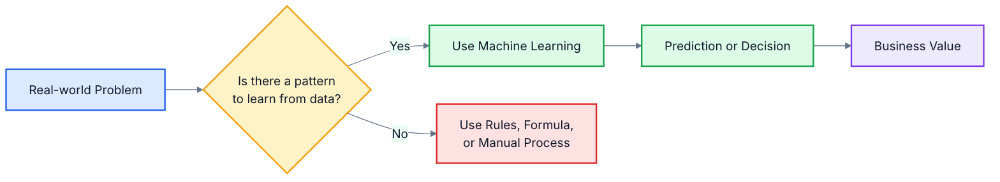

**In plain English:** Machine Learning is useful when writing fixed rules is difficult, but examples are available. The computer learns patterns from examples and uses those patterns to make better decisions.

---

## 2. What Is Machine Learning?

Now I will define Machine Learning in a simple way.

Machine Learning is the science and engineering of building computer systems that learn from data.

A beginner-friendly definition is:

> Machine Learning is a way of programming computers so that they can improve their performance on a task by learning from experience.

This means ML systems are not only executing fixed instructions. They are using data to discover patterns and improve predictions.

For example, a spam filter learns from old emails. A recommendation system learns from user behavior. A car price prediction system learns from previous car sale records.

A useful way to define a Machine Learning problem is through three elements:

```text
Learning Task = <Task, Performance, Experience>
```

| Element | Meaning | Example: Spam Filtering |
|---|---|---|
| Task | What the system must do | Classify emails as spam or Not Spam |
| Performance | How success is measured | Percentage of emails correctly classified |
| Experience | What the system learns from | Past emails labeled as spam or Not Spam |

Let us look at a few more examples.

| Use Case | Task | Performance Measure | Experience |
|---|---|---|---|
| Handwritten word recognition | Recognize handwritten words | Percentage of words correctly classified | Labeled images of handwritten words |
| Fraud detection | Detect fraudulent transactions | Fraud detection rate, false alarm rate | Historical transaction data |
| Medical diagnosis | Predict disease risk | Correct diagnosis rate, low false negatives | Patient records and diagnosis labels |
| Car price prediction | Predict used car price | Difference between actual and predicted price | Past used-car sale records |

The quality of the learned model depends strongly on the quality of the experience. If the training data is incomplete, biased, noisy, or not representative of real-world cases, the model may perform poorly.

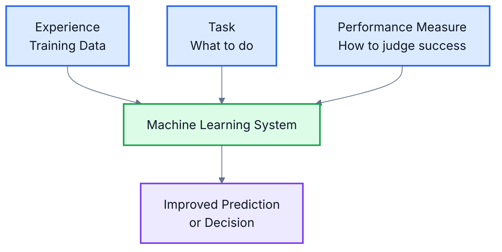

**In plain English:** Machine Learning means giving computers examples so they can learn useful patterns and make predictions on new cases.

---

## 3. AI, Data Science, and Machine Learning: How They Relate

I often see beginners use Artificial Intelligence, Data Science, and Machine Learning as if they mean the same thing. They are related, but they are not exactly the same.

| Term | Simple Meaning | Example |
|---|---|---|
| Artificial Intelligence | Making machines perform tasks that appear intelligent | A voice assistant answering questions |
| Machine Learning | Teaching machines to learn patterns from data | A fraud model learning from transactions |
| Data Science | Collecting, preparing, analyzing, and explaining data | An analyst studying customer purchase behavior |

Artificial Intelligence is the broad field. It includes systems that reason, plan, understand language, recognize images, play games, or make decisions.

Machine Learning is a major part of AI. It focuses on learning from data rather than manually programming every rule.

Data Science overlaps with Machine Learning, but it also includes data collection, cleaning, visualization, reporting, experimentation, and business interpretation.

For example, in a customer churn project:

| Activity | Mostly Related To |
|---|---|
| Collecting customer data | Data Science |
| Cleaning missing values | Data Science |
| Training a churn prediction model | Machine Learning |
| Automatically recommending retention actions | Artificial Intelligence |
| Explaining churn reasons to management | Data Science and Business Analytics |

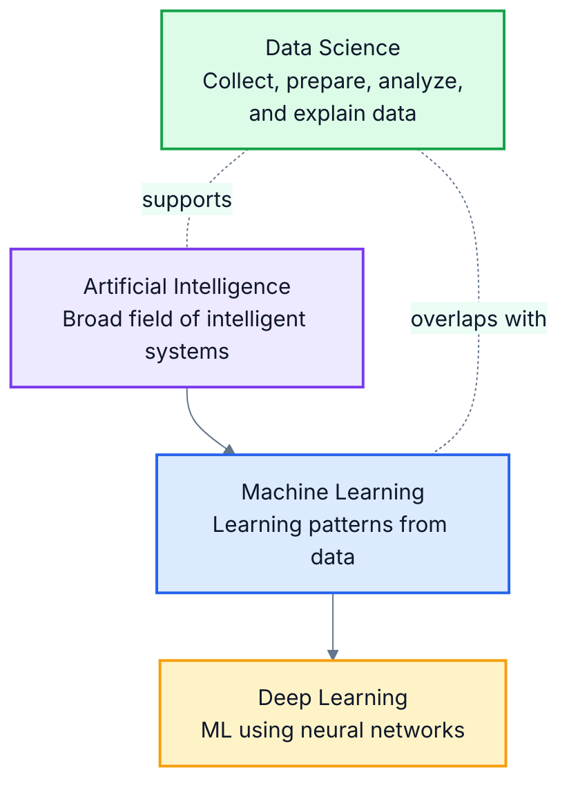

**In plain English:** AI is the bigger goal of making machines intelligent. Machine Learning is one way to achieve AI by learning from data. Data Science helps us collect, understand, and use data effectively.

---

## 4. Traditional Programming vs Machine Learning

In this section, I will compare Machine Learning with traditional programming.

In traditional programming, humans write rules. The computer applies those rules to data and produces output.

In Machine Learning, humans provide data and examples. The computer learns patterns from those examples and creates a model. That model is then used to make predictions on new data.

### Traditional Programming Example

Suppose I want to calculate income tax. The rules are known in advance.

```text
Input: income
Rules: tax slabs and tax rates
Output: tax amount
```

This is a good traditional programming problem because the rules are clear.

### Machine Learning Example

Suppose I want to detect fraudulent bank transactions. The rules are not always clear. Fraud patterns change over time. Fraudsters may behave differently in different regions, time windows, transaction amounts, or devices.

In this case, I can train an ML model using historical transaction data.

| Transaction Amount | Location | Time | Device Type | Fraud? |
|---:|---|---|---|---|
| 500 | Bangalore | Morning | Known device | No |
| 95,000 | Unknown city | Midnight | New device | Yes |
| 1,200 | Pune | Afternoon | Known device | No |

The ML model learns patterns that are commonly associated with fraud.

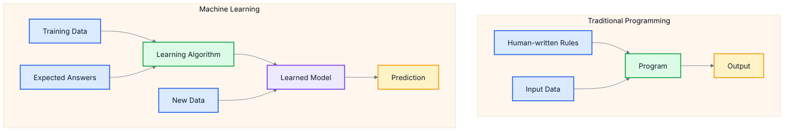

| Aspect | Traditional Programming | Machine Learning |
|---|---|---|
| Main input | Rules and data | Data and examples |
| Who defines logic? | Human programmer | Learning algorithm discovers patterns |
| Best for | Clear and stable rules | Complex or changing patterns |
| Output | Direct result | Model and predictions |
| Example | Payroll calculation | Spam filtering, fraud detection |

**In plain English:** Traditional programming says, “Tell the computer the rules.” Machine Learning says, “Show the computer examples and let it learn useful rules from data.”

---

## 5. Common Applications of Machine Learning

Machine Learning is used across many industries and products. Sometimes users directly interact with ML systems. Other times, ML works quietly in the background.

I will explain a few common application areas below.

### Smartphones and Digital Assistants

Smartphones use ML for voice recognition, face unlock, keyboard suggestions, photo organization, and digital assistants.

Examples include Siri, Google Assistant, Alexa, Cortana, and Bixby. These systems may use ML to understand speech, process language, identify intent, and generate helpful responses.

**In plain English:** When your phone understands your voice, suggests words, or organizes photos, ML may be working behind the scenes.

### Recommendation Systems

Recommendation systems suggest products, movies, books, food, hotels, or content based on user behavior.

| Platform Type | Recommendation Example |
|---|---|
| E-commerce | Products you may want to buy |
| Movie platforms | Movies or shows you may like |
| Food delivery apps | Restaurants you may prefer |
| Travel platforms | Hotels or destinations matching your interest |
| Banking platforms | Personalized offers or services |

**In plain English:** Recommendation systems learn from what users view, click, buy, rate, or ignore.

### Security and Fraud Detection

Banks, payment systems, and cybersecurity platforms use ML to detect unusual activity.

A fraud detection model may look at transaction amount, location, device, merchant type, customer history, and time of transaction. If the behavior looks unusual, the transaction may be flagged for review.

**In plain English:** ML can help detect suspicious behavior that may indicate fraud, cyberattacks, or misuse.

### Healthcare and Medical Diagnosis

ML can support healthcare by analyzing medical records, images, symptoms, or lab results.

For example, a model may help predict whether a tumor is benign or malignant based on medical measurements. Another model may help identify risk patterns in patient history.

ML should support expert decision-making in healthcare. It should not blindly replace qualified medical judgment.

**In plain English:** ML can help doctors find patterns in medical data, but human expertise remains very important.

### Transportation and Navigation

ML helps with route optimization, traffic prediction, public transport planning, logistics, driver assistance, and autonomous driving research.

A navigation app may use historical and real-time traffic data to estimate travel time and suggest a better route.

**In plain English:** ML helps transport systems make better decisions using traffic, location, sensor, and historical data.

### Sales, Marketing, and Customer Analytics

Businesses use ML to understand customers, segment markets, forecast demand, predict churn, and personalize campaigns.

For example, a retailer may group customers into high spenders, medium spenders, and low spenders based on income, number of visits, and average monthly spending.

**In plain English:** ML helps businesses understand customers better and offer more relevant products, services, or support.

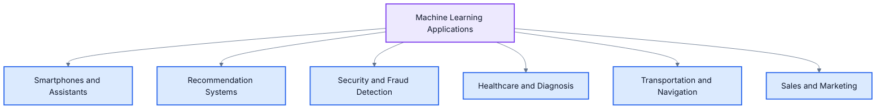

**In plain English:** Machine Learning is useful wherever data can reveal patterns that help make better predictions or decisions.

---

## 6. Types of Machine Learning

Machine Learning can be divided into different types based on the kind of learning signal available.

In this chapter, I will focus on four major types:

1. Supervised Learning
2. Unsupervised Learning
3. Reinforcement Learning
4. Semi-Supervised Learning

Inside supervised learning, I will explain two important task types: regression and classification.

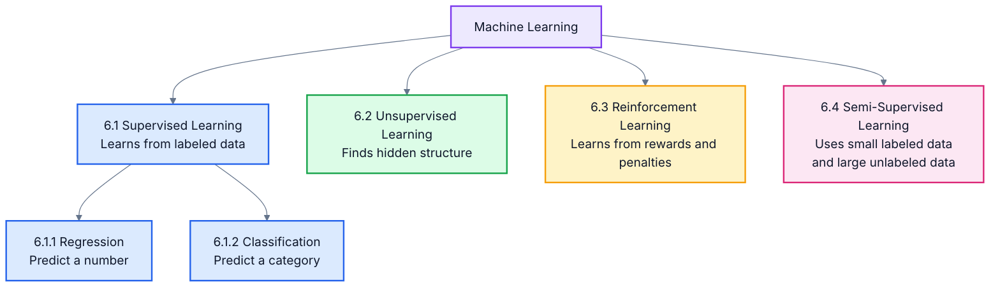

**In plain English:** Different types of Machine Learning depend on what kind of feedback the model receives: correct answers, no answers, rewards, or partial answers.

---

### 6.1 Supervised Learning

Supervised Learning is a type of Machine Learning where the model learns from labeled examples.

A labeled example contains input data and the correct output.

```text
Input features + Correct answer = Training example
```

Let me explain this with the Spam vs Not Spam example.

In email filtering, `spam` means an unwanted or harmful email. `Not Spam` means a normal, legitimate email. If I already have many old emails labeled as spam or Not Spam, I can use them to train a supervised learning model.

| Email Feature | Example Value | Label |
|---|---|---|
| Subject contains prize-related words | Yes | Spam |
| Sender is known contact | Yes | Not Spam |
| Email contains suspicious link | Yes | Spam |
| Email is from office domain | Yes | Not Spam |

Here, the email content, sender information, keywords, links, and metadata are input features. The correct output label is either `Spam` or `Not Spam`.

The goal of supervised learning is to learn a function that maps input features to the correct output.

```text
f(input features) = predicted output
```

Common supervised learning algorithms include:

| Algorithm | Common Use |
|---|---|
| Linear Regression | Predicting numerical values |
| Logistic Regression | Binary classification |
| Naive Bayes | Text classification and spam filtering |
| Support Vector Machines | Classification problems |
| Decision Trees | Rule-like classification and regression |
| Random Forests | Robust prediction using many decision trees |
| Neural Networks | Complex pattern learning |

**In plain English:** Supervised learning is like learning with a teacher. The model sees examples along with correct answers and learns how to answer new cases.

---

#### 6.1.1 Regression

Regression is a supervised learning task where the output is a number.

I use regression when I want to predict a continuous numerical value such as price, salary, sales, distance, or temperature.

Examples of regression problems:

| Problem | Input | Numeric Output |
|---|---|---|
| Car price prediction | Brand, year, mileage, distance travelled | Price |
| House price prediction | Size, location, number of rooms | Price |
| Demand forecasting | Past sales, season, price | Future sales |
| Salary prediction | Experience, education, role | Salary |
| Temperature forecasting | Historical weather data | Temperature |

Consider used car price prediction. The input features may include brand, manufacturing year, engine capacity, mileage, distance travelled, and whether the car was used as a cab.

| Brand | Year | Engine Capacity | Mileage | Distance Travelled | Cab? | Price |
|---|---:|---:|---:|---:|---|---:|
| Honda City ZX | 2008 | 1100 | 10.5 | 45000 | No | 350000 |

The model learns the relationship between these features and the price.

If the output is an exact price, it is a regression problem. If the output is a label such as `Low Price`, `Medium Price`, or `High Price`, it becomes a classification problem.

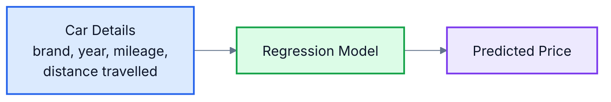

**In plain English:** Regression means predicting a number, such as price, salary, sales, distance, or temperature.

---

#### 6.1.2 Classification

Classification is a supervised learning task where the output is a category or class.

I use classification when I want the model to choose from a fixed set of labels.

Examples of classification problems:

| Problem | Input | Output Class |
|---|---|---|
| Spam filtering | Email content | Spam or Not Spam |
| Fraud detection | Transaction details | Fraud or Genuine |
| Medical diagnosis | Patient measurements | Benign or Malignant |
| Image recognition | Image pixels | Cat, Dog, Car, Person |
| Sentiment analysis | Product review text | Positive, Negative, Neutral |

A simple classification example is spam filtering. Given an email, the model studies the subject line, sender, message body, links, and previous patterns. It then predicts whether the email is `Spam` or `Not Spam`.

In real systems, classification usually depends on many features, not just one.

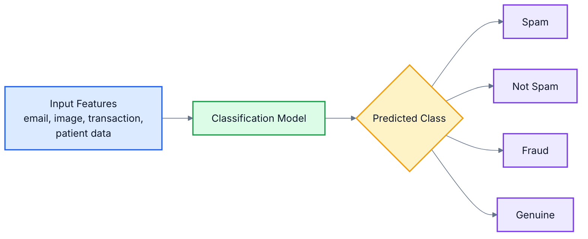

**In plain English:** Classification means choosing a label, such as spam or Not Spam, fraud or genuine, benign or malignant.

---

### 6.2 Unsupervised Learning

Unsupervised Learning is a type of Machine Learning where the model receives data without correct output labels.

The model tries to find hidden structure in the data.

A common example is customer segmentation. Suppose a retailer has customer information such as income, number of visits, average monthly spending, and zip code.

| Family Income | Visits per Month | Average Monthly Spend | Zip Code |
|---:|---:|---:|---|
| 1150000 | 4 | 8000 | 500078 |
| 420000 | 2 | 1500 | 411001 |
| 1800000 | 8 | 25000 | 560037 |

There may be no label saying `High Spender`, `Medium Spender`, or `Low Spender`. An unsupervised learning algorithm can group similar customers based on patterns in the data.

Common unsupervised learning tasks include:

| Task | Meaning |
|---|---|
| Clustering | Group similar records together |
| Dimensionality reduction | Reduce many features into fewer useful features |
| Association discovery | Find items or behaviors that occur together |
| Anomaly detection | Identify unusual records |

Common techniques include k-Means clustering, hierarchical clustering, expectation maximization, principal component analysis, and visualization methods.

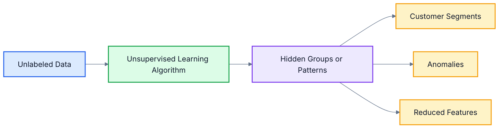

**In plain English:** Unsupervised learning means the model does not get correct answers. It tries to discover groups, patterns, or unusual cases by itself.

---

### 6.3 Reinforcement Learning

Reinforcement Learning is a type of Machine Learning where an agent learns by interacting with an environment.

The agent takes actions. The environment responds with rewards or penalties. Over time, the agent learns which actions lead to better long-term results.

Examples:

| Scenario | Agent | Environment | Reward |
|---|---|---|---|
| Game playing | Game AI | Game board | Winning or scoring points |
| Robot navigation | Robot | Physical space | Reaching destination safely |
| Autonomous driving research | Driving system | Road or simulator | Safe and efficient driving |
| Recommendation optimization | Recommendation engine | User interaction | Clicks, purchases, satisfaction |

Reinforcement Learning is different from supervised learning because the correct answer is not always given immediately. The system may need to try multiple actions and learn from delayed feedback.

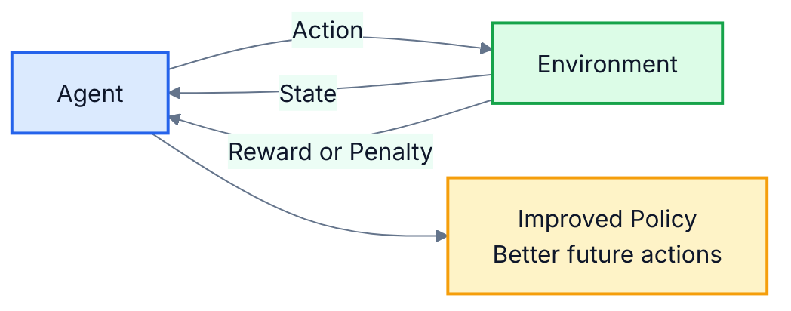

**In plain English:** Reinforcement Learning is like learning through trial and error. Good actions receive rewards, and bad actions receive penalties.

---

### 6.4 Semi-Supervised Learning

Semi-Supervised Learning combines supervised and unsupervised learning.

It is used when we have a small amount of labeled data and a large amount of unlabeled data.

This is common in real-world projects because labeling data can be expensive and time-consuming.

Example: Photo organization.

A photo application may have a few labeled photos, such as:

| Photo | Label |
|---|---|
| Photo 1 | Person A |
| Photo 2 | Person B |
| Photo 3 | Person A |

But the same application may have thousands of unlabeled photos. Semi-supervised learning can use the small labeled set along with the large unlabeled set to improve grouping and recognition.

Semi-supervised learning is useful in domains such as:

| Domain | Why It Helps |
|---|---|
| Medical imaging | Expert labels are expensive |
| Speech recognition | Audio is easy to collect, transcripts are costly |
| Image classification | Many images exist, but labels require effort |
| Document classification | Large document sets are often unlabeled |

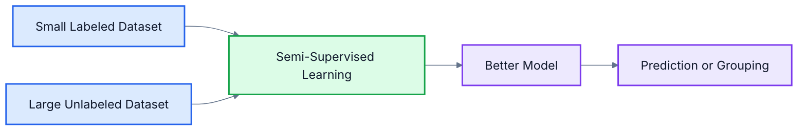

**In plain English:** Semi-supervised learning is useful when we have a few answered examples and many unanswered examples.

---

## 7. The Machine Learning Workflow

A Machine Learning project is not just about choosing an algorithm. It is a complete process that starts with understanding the problem and ends with evaluating and improving the model.

Here is the high-level workflow I follow when thinking about an ML problem:

1. Decide whether ML is suitable for the problem.
2. Gather and organize data.
3. Clean, preprocess, and visualize data.
4. Choose a model and learning approach.
5. Train the model.
6. Optimize model parameters and hyperparameters.
7. Evaluate performance.
8. Analyze mistakes and iterate.

```mermaid
%%{init: {"theme":"base", "themeVariables": {"primaryColor":"#E8F3FF", "primaryTextColor":"#0F172A", "primaryBorderColor":"#2563EB", "lineColor":"#64748B", "secondaryColor":"#ECFDF5", "tertiaryColor":"#FFF7ED", "fontFamily":"Inter, Segoe UI, Arial"}}}%%
flowchart LR
    A[1. Define Problem] --> B[2. Gather Data]
    B --> C[3. Clean and Prepare Data]
    C --> D[4. Explore Data]
    D --> E[5. Choose Model]
    E --> F[6. Train Model]
    F --> G[7. Evaluate Performance]
    G --> H{Good Enough?}
    H -->|No| C
    H -->|Yes| I[Use or Deploy Model]
    I --> J[Monitor and Improve]

    classDef blue fill:#DBEAFE,stroke:#2563EB,color:#0F172A,stroke-width:2px;
    classDef green fill:#DCFCE7,stroke:#16A34A,color:#0F172A,stroke-width:2px;
    classDef yellow fill:#FEF3C7,stroke:#F59E0B,color:#0F172A,stroke-width:2px;
    classDef purple fill:#EDE9FE,stroke:#7C3AED,color:#0F172A,stroke-width:2px;

    class A,B,C,D blue;
    class E,F,G green;
    class H yellow;
    class I,J purple;
```

### Step 1: Decide Whether ML Is Suitable

Before using ML, I first ask:

| Question | Why It Matters |
|---|---|
| Is there a pattern to learn? | ML needs patterns in data |
| Do we have relevant data? | Without data, the model cannot learn |
| Can a simple rule solve the problem? | ML may be unnecessary for rule-based tasks |
| What is the cost of mistakes? | Wrong predictions may have serious impact |
| How will success be measured? | The goal must be measurable |

For example, spam filtering is suitable for ML because patterns change and many examples exist. Payroll calculation is usually not suitable for ML because rules are clearly defined.

**In plain English:** Do not use ML just because it is popular. Use it when data patterns can solve the problem better than fixed rules.

### Step 2: Gather and Organize Data

Data may come from databases, logs, surveys, sensors, images, text, transactions, or user behavior.

For car price prediction, data may come from past car listings or actual sale records.

Good data should be:

| Quality | Meaning |
|---|---|
| Relevant | Connected to the problem |
| Complete | Important fields are not missing |
| Correct | Values are accurate |
| Representative | Similar to future cases |
| Consistent | Same meaning and format across records |

**In plain English:** The model learns from data. Better data usually leads to better learning.

### Step 3: Clean, Preprocess, and Visualize Data

Raw data is rarely ready for Machine Learning.

Common preprocessing activities include:

| Activity | Example |
|---|---|
| Handle missing values | Fill missing mileage values |
| Remove duplicates | Remove repeated customer records |
| Fix invalid values | Correct impossible age or negative salary |
| Encode categories | Convert brand names into numeric form |
| Scale numeric values | Bring income and age to comparable ranges |
| Split data | Create training and test datasets |

Visualization helps us understand the data before modeling. It can reveal outliers, missing patterns, class imbalance, or relationships between features.

**In plain English:** Data preparation is like preparing ingredients before cooking. If the ingredients are poor, the final result will also be poor.

### Step 4: Choose, Train, and Evaluate a Model

After preparing data, I choose a model based on the problem type.

| Problem Type | Example Model |
|---|---|
| Predict a number | Linear regression, decision tree, random forest |
| Predict a category | Logistic regression, naive Bayes, SVM |
| Group similar records | k-Means clustering |
| Learn from rewards | Reinforcement learning algorithm |

Training means the model learns from examples.

Evaluation means testing whether the model performs well on data it has not seen during training.

**In plain English:** Training is learning from examples. Evaluation checks whether the learning works on new cases.

### Step 5: Improve and Iterate

Machine Learning development is iterative. A model is rarely perfect in the first attempt.

If the model does not perform well, I may need to:

- Add more relevant data.
- Clean the data more carefully.
- Create better features.
- Try a different algorithm.
- Tune hyperparameters.
- Revisit the business objective.

The workflow often loops back from evaluation to preprocessing, feature engineering, or model selection.

**In plain English:** Machine Learning is not a one-time activity. It improves through repeated testing, learning, and refinement.

---

This chapter introduced the basic idea of Machine Learning: learning from data to make predictions or decisions. I explained why ML matters, how it differs from traditional programming, how it relates to AI and Data Science, where it is commonly used, and what major types of ML exist.

The next chapter will go deeper into the Machine Learning workflow, including data preparation, feature engineering, train-test split, model training, and evaluation.
