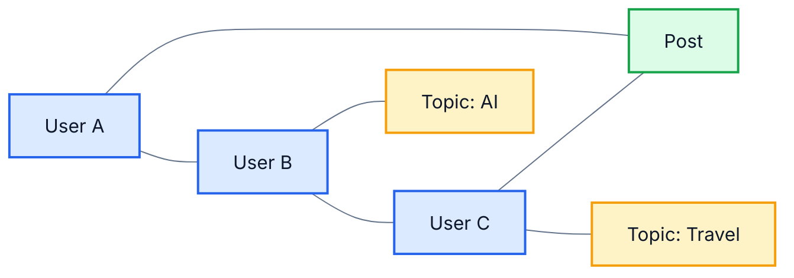
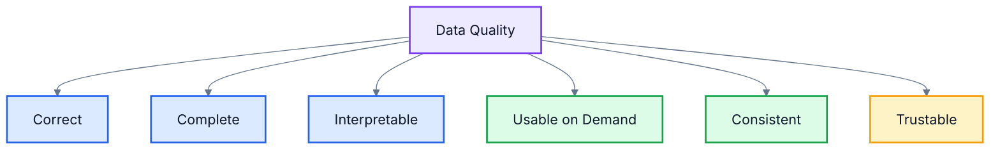
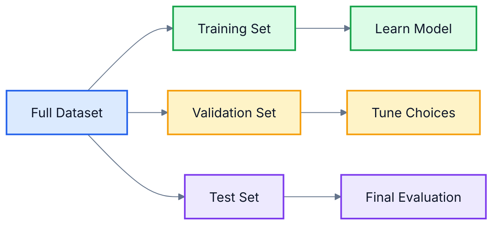
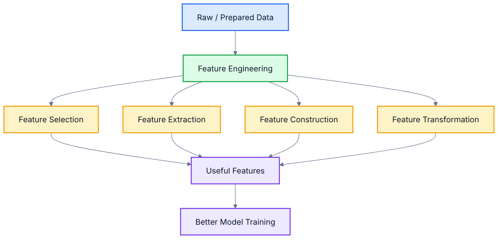
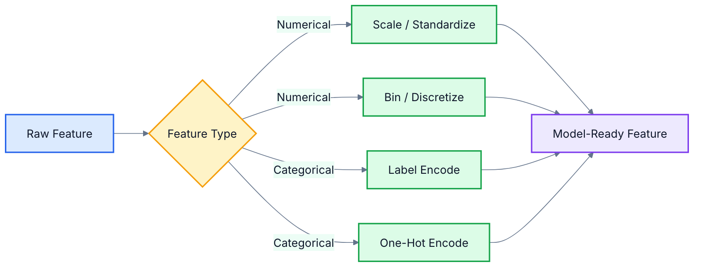

# Chapter 2: Data Preprocessing

In Chapter 1, I introduced Machine Learning as a way of helping computers learn patterns from data. In this chapter, I will explain one of the most important parts of any Machine Learning project: **Data Preprocessing**.

Many beginners think that Machine Learning starts with choosing an algorithm. In practice, I have found that a large part of ML success depends on how well the data is understood, cleaned, selected, transformed, and prepared before training the model.

A good model trained on poor data usually gives poor results. A simple model trained on well-prepared data can often perform surprisingly well.

---

## Table of Contents

- [1. Data Types](#1-data-types)
  - [1.1 Relational/Object Data](#11-relationalobject-data)
  - [1.2 Transactional Data](#12-transactional-data)
  - [1.3 Document Data](#13-document-data)
  - [1.4 Web and Social Network Data](#14-web-and-social-network-data)
  - [1.5 Spatial Data](#15-spatial-data)
  - [1.6 Time Series Data](#16-time-series-data)
  - [1.7 Sequence Data](#17-sequence-data)
- [2. Data Quality](#2-data-quality)
  - [2.1 Correct Data](#21-correct-data)
  - [2.2 Complete Data](#22-complete-data)
  - [2.3 Interpretable Data](#23-interpretable-data)
  - [2.4 Usable-on-Demand Data](#24-usable-on-demand-data)
  - [2.5 Consistent Data](#25-consistent-data)
  - [2.6 Trustable Data](#26-trustable-data)
- [3. Data Preprocessing](#3-data-preprocessing)
  - [3.1 Data Aggregation](#31-data-aggregation)
  - [3.2 Data Cleansing](#32-data-cleansing)
  - [3.3 Instance Selection and Partitioning](#33-instance-selection-and-partitioning)
  - [3.4 Feature Tuning](#34-feature-tuning)
- [4. Feature Engineering](#4-feature-engineering)
  - [4.1 Why Feature Engineering Is Needed](#41-why-feature-engineering-is-needed)
  - [4.2 Irrelevant Features](#42-irrelevant-features)
  - [4.3 Feature Extraction and Dimensionality Reduction](#43-feature-extraction-and-dimensionality-reduction)
  - [4.4 Feature Selection](#44-feature-selection)
  - [4.5 Feature Construction](#45-feature-construction)
  - [4.6 Feature Transformation](#46-feature-transformation)
- [5. Chapter Recap](#5-chapter-recap)
- [6. Bridge to the Next Chapter](#6-bridge-to-the-next-chapter)

---

## 1. Data Types

Before I explain preprocessing, I first want to explain what kind of data we may receive in a Machine Learning project.

In technical terms, **data** is a collection of objects and their attributes. An object may also be called a record, instance, sample, case, entity, or data point. An attribute may also be called a variable, field, feature, dimension, or characteristic.

For example, in a customer table, each customer is an object and columns such as age, income, city, card type, and credit score are attributes.

```mermaid
%%{init: {"theme":"base", "themeVariables": {"primaryColor":"#E8F3FF", "primaryTextColor":"#0F172A", "primaryBorderColor":"#2563EB", "lineColor":"#64748B", "secondaryColor":"#ECFDF5", "tertiaryColor":"#FFF7ED", "fontFamily":"Inter, Segoe UI, Arial"}}}%%
flowchart LR
    A[Raw Data Sources] --> B[Objects / Instances]
    B --> C[Attributes / Features]
    C --> D[Prepared Dataset]
    D --> E[Machine Learning Model]

    classDef source fill:#DBEAFE,stroke:#2563EB,color:#0F172A,stroke-width:2px;
    classDef object fill:#DCFCE7,stroke:#16A34A,color:#0F172A,stroke-width:2px;
    classDef feature fill:#FEF3C7,stroke:#F59E0B,color:#0F172A,stroke-width:2px;
    classDef prepared fill:#EDE9FE,stroke:#7C3AED,color:#0F172A,stroke-width:2px;
    classDef model fill:#FCE7F3,stroke:#DB2777,color:#0F172A,stroke-width:2px;

    class A source;
    class B object;
    class C feature;
    class D prepared;
    class E model;
```



Different data types need different preprocessing techniques. I will explain the most common data types below.

| Data Type | What It Looks Like | Common ML Use |
|---|---|---|
| Relational/Object Data | Rows and columns | Classification, regression, customer analytics |
| Transactional Data | Purchases, events, logs | Market basket analysis, fraud detection |
| Document Data | Text documents | Search, classification, sentiment analysis |
| Web and Social Network Data | Pages, links, posts, graphs | Recommendation, influence analysis |
| Spatial Data | Locations, maps, coordinates | Route planning, geospatial analytics |
| Time Series Data | Values over time | Forecasting, monitoring |
| Sequence Data | Ordered events or symbols | Speech, text, DNA, user journey analysis |

**In plain English:**  
Data can come in many forms. Before building a model, I must understand what kind of data I am working with because every data type needs a different preparation strategy.

---

### 1.1 Relational/Object Data

**Relational data** is structured data usually stored in tables. Each row represents an object or instance, and each column represents an attribute or feature.

In technical terms, relational data follows a schema. A schema defines the structure of the data, such as column names, data types, and relationships between tables.

Example: Bank customer data.

| Customer Name | Gender | Service Rating | Card Type | Credit Score | Income Level | Region |
|---|---|---:|---|---:|---|---|
| Jack | Male | 5 | Platinum | 7.5 | Upper | BGLR |
| Jill | Female | 2 | Gold | 8.2 | Middle | DELHI |
| John | Male | 9 | Gold | 7.0 | Lower | BGLR |

In this example, each customer is an object. Gender, service rating, card type, credit score, income level, and region are attributes.

Machine Learning models often work well with relational data after we clean missing values, encode categorical fields, scale numeric values, and split the data into training and test sets.

**Example use case:**  
A bank may use customer data to segment customers for targeted marketing. Customers with high income level and premium card types may be grouped for special offers.

**In plain English:**  
Relational data is like an Excel sheet or database table. Each row is one item, and each column describes something about that item.

---

### 1.2 Transactional Data

**Transactional data** records events or transactions. Each record usually captures what happened, when it happened, who was involved, and sometimes where it happened.

In technical terms, transactional data is event-oriented. It is often generated continuously from business operations, user activity, payments, shopping carts, banking systems, or logs.

Example: Retail purchase transactions.

| Transaction ID | Customer ID | Item | Store | Date | Price |
|---|---|---|---|---|---:|
| T101 | C001 | Watch | Chicago | 2026-01-10 | 1200 |
| T102 | C002 | Battery | Bangalore | 2026-01-10 | 250 |
| T103 | C001 | Shoes | Chicago | 2026-01-11 | 2500 |

Transactional data is useful for detecting buying patterns, fraud patterns, product combinations, and unusual behavior.

**Example use case:**  
In fraud detection, a model can learn from past transactions and identify suspicious behavior such as unusually large payments, new locations, or unexpected transaction times.

**In plain English:**  
Transactional data is a record of activities. It answers questions like: who did what, when, where, and for how much?

---

### 1.3 Document Data

**Document data** is text-based data. It can include emails, product reviews, articles, reports, support tickets, legal documents, resumes, and social media posts.

In technical terms, document data is usually unstructured or semi-structured. Before using it in ML, text must be converted into numerical features because ML models cannot directly understand raw text.

Example: Product review documents.

| Document ID | Review Text | Sentiment |
|---|---|---|
| D001 | The phone camera is excellent | Positive |
| D002 | Battery life is poor | Negative |
| D003 | Display is good but price is high | Mixed |

Common preprocessing steps for document data include tokenization, lowercasing, stop-word removal, stemming or lemmatization, and converting text into vectors using techniques such as bag-of-words, TF-IDF, or embeddings.

**Example use case:**  
A company can classify customer support tickets into categories such as billing issue, technical issue, refund request, or product feedback.

**In plain English:**  
Document data is text. To use text in ML, I first convert words and sentences into numbers that a model can process.

---

### 1.4 Web and Social Network Data

**Web and social network data** comes from websites, hyperlinks, user profiles, posts, comments, likes, shares, followers, and connections between users.

In technical terms, this data is often graph-based. A graph contains nodes and edges. A node may represent a person, page, product, or account. An edge may represent a relationship such as follows, likes, purchases, links to, or shares.

Example: Social network data.

| User | Follows | Likes Topic | Shared Post? |
|---|---|---|---|
| Amit | Neha | AI | Yes |
| Neha | Priya | Travel | No |
| Priya | Amit | Fitness | Yes |

This data is useful for recommendation systems, community detection, influencer analysis, fraud detection, and content ranking.

**Example use case:**  
A social platform may recommend new people to follow based on common friends, shared interests, and interaction history.



**In plain English:**  
Web and social network data is about connections. It helps ML systems understand relationships between people, pages, products, and interests.

---

### 1.5 Spatial Data

**Spatial data** represents locations, shapes, distances, regions, routes, and geographic areas.

In technical terms, spatial data may contain coordinates, polygons, lines, map regions, GPS points, or location-based attributes. It is commonly used in Geographic Information Systems, navigation, logistics, agriculture, mobility, and urban planning.

Example: Delivery location data.

| Delivery ID | Latitude | Longitude | City | Delivery Time |
|---|---:|---:|---|---:|
| D001 | 12.9716 | 77.5946 | Bangalore | 35 min |
| D002 | 19.0760 | 72.8777 | Mumbai | 48 min |
| D003 | 28.6139 | 77.2090 | Delhi | 42 min |

Spatial data often needs special preprocessing such as coordinate normalization, distance calculation, region grouping, map matching, and spatial clustering.

**Example use case:**  
A logistics company may use spatial data to predict delivery time based on pickup location, drop location, traffic zone, and distance.

**In plain English:**  
Spatial data is location data. It helps ML understand where something is and how distance or geography affects the problem.

---

### 1.6 Time Series Data

**Time series data** is data collected over time at regular or irregular intervals.

In technical terms, time series data has temporal dependency. This means the order of observations matters, and current values may depend on previous values.

Example: Monthly sales data.

| Month | Sales |
|---|---:|
| January | 1200 |
| February | 1350 |
| March | 1600 |
| April | 1500 |

Time series preprocessing may include sorting by timestamp, handling missing time periods, smoothing noise, detecting seasonality, creating lag features, and removing outliers.

**Example use case:**  
A retailer may forecast next month’s sales using previous sales, festival seasons, discounts, and market trends.


**In plain English:**  
Time series data is data arranged by time. To understand it, I must respect the order of events.

---

### 1.7 Sequence Data

**Sequence data** is ordered data where the order of elements carries meaning.

Time series is one type of sequence data, but sequence data is broader. It may include text, speech, DNA, clickstreams, user journeys, and event sequences.

In technical terms, sequence data contains dependencies between neighboring or earlier elements. The model often needs to learn context from previous elements to predict the next element or classify the full sequence.

Example: User journey sequence.

```text
Home Page -> Product Page -> Cart -> Payment -> Order Confirmation
```

Example: Text sequence.

```text
Machine -> Learning -> needs -> good -> data
```

**Example use case:**  
A website may analyze user click sequences to predict whether a user will purchase, abandon the cart, or need support.

**In plain English:**  
Sequence data is data where order matters. Changing the order can change the meaning.

---

## 2. Data Quality

After identifying the data type, I need to check data quality.

In technical terms, **data quality** refers to how suitable the data is for analysis, modeling, decision-making, and production usage. High-quality data should be correct, complete, interpretable, available when needed, consistent, and trustable.

Poor-quality data causes poor model performance. Common data quality problems include noise, outliers, wrong values, fake data, missing values, and duplicate records.



**In plain English:**  
Data quality means whether the data is good enough to use. If the data is wrong, missing, confusing, or unreliable, the model will also become unreliable.

---

### 2.1 Correct Data

**Correct data** means the values accurately represent reality.

In technical terms, correctness checks whether the recorded value is valid and truthful for the object being described. Incorrect data may come from human entry mistakes, sensor errors, system bugs, wrong calculations, or integration failures.

Example of incorrect data:

| Field | Incorrect Value | Why It Is Wrong |
|---|---:|---|
| Salary | -10 | Salary cannot be negative |
| Age | 42 | But date of birth says 2010 |
| Product Quantity | 0 | But invoice amount is positive |

**Example use case:**  
If a bank model uses incorrect income values, it may wrongly approve or reject loan applications.

**In plain English:**  
Correct data means the value should make sense and match reality.

---

### 2.2 Complete Data

**Complete data** means the required values are available.

In technical terms, completeness measures whether important fields are missing or unavailable. Missing values can reduce model accuracy because the model may not have enough information to learn meaningful patterns.

Example:

| Customer ID | Age | Income | Credit Score |
|---|---:|---:|---:|
| C001 | 32 | 900000 | 780 |
| C002 | 41 | NULL | 710 |
| C003 | NULL | 600000 | NULL |

In this table, income and credit score are missing for some customers.

Common ways to handle missing values include:

| Method | Meaning | Example |
|---|---|---|
| Remove rows | Drop records with too many missing values | Remove customers with no usable fields |
| Remove columns | Drop features with too many missing values | Drop a field missing in 90% records |
| Imputation | Fill missing values | Replace missing income with median income |
| Add missing indicator | Create a flag for missingness | `income_missing = 1` |

**Example use case:**  
For medical diagnosis, missing test results may make predictions unsafe. The system must either collect missing values or handle them carefully.

**In plain English:**  
Complete data means the important information should not be missing.

---

### 2.3 Interpretable Data

**Interpretable data** means humans can understand the meaning of the data.

In technical terms, interpretability refers to whether data fields, units, labels, and values are meaningful and documented. If a feature name is unclear, the model may still train, but humans may not understand or trust the result.

Example of unclear data:

| Column Name | Problem |
|---|---|
| `X1` | Meaning unknown |
| `Score` | Score out of what? |
| `Amt` | Amount in rupees, dollars, or thousands? |

Better version:

| Column Name | Clear Meaning |
|---|---|
| `customer_age_years` | Age in years |
| `credit_score_0_to_900` | Credit score range |
| `monthly_income_inr` | Income in Indian rupees |

**Example use case:**  
A business team may reject an ML report if it uses unclear column names and unexplained scores.

**In plain English:**  
Interpretable data means people should understand what each field means.

---

### 2.4 Usable-on-Demand Data

**Usable-on-demand data** means data is available when needed and in a form that can be used by the ML pipeline.

In technical terms, this refers to data accessibility, availability, latency, freshness, format compatibility, and pipeline readiness.

Example:

| Requirement | Good Data Condition |
|---|---|
| Daily fraud model | Transaction data should be available daily |
| Real-time recommendation | User activity should be available quickly |
| Monthly sales forecast | Historical sales should be available before planning |

**Example use case:**  
If a fraud detection model receives transaction data after two days, it may be too late to stop fraudulent payments.

**In plain English:**  
Usable-on-demand data means the right data should be available at the right time.

---

### 2.5 Consistent Data

**Consistent data** means the same concept is represented in the same way across records, systems, and time.

In technical terms, consistency checks whether values follow the same format, unit, encoding, naming convention, and business meaning.

Example of inconsistency:

| Record | Rating Value | Problem |
|---|---|---|
| Old system | 1, 2, 3 | Numeric rating |
| New system | A, B, C | Letter rating |
| Duplicate customer | Mumbai | City name |
| Duplicate customer | BOM | Airport/city code |

Another example:

| Age | Date of Birth | Problem |
|---:|---|---|
| 42 | 03-07-2010 | Both cannot be true at the same time |

**Example use case:**  
If one system records income monthly and another records income yearly, combining them without conversion will create misleading data.

**In plain English:**  
Consistent data means the same thing should be written in the same way everywhere.

---

### 2.6 Trustable Data

**Trustable data** means the data source, collection process, and values are reliable enough for decision-making.

In technical terms, trustability depends on data lineage, source reliability, auditability, governance, correctness checks, and protection against fake or manipulated data.

Example problems:

| Problem | Why It Reduces Trust |
|---|---|
| Fake data | Model learns patterns that do not exist |
| Duplicate data | Some records get extra importance |
| Sensor noise | Measurements become distorted |
| Unknown source | Values cannot be verified |

**Example use case:**  
In credit scoring, using unverified or manipulated income data can lead to wrong lending decisions.

**In plain English:**  
Trustable data means I can rely on the data source and believe that the values are genuine.

---

## 3. Data Preprocessing

**Data preprocessing** is the process of converting raw data into prepared data suitable for Machine Learning.

In technical terms, preprocessing includes data engineering and feature engineering. Data engineering converts raw data into a clean and organized dataset. Feature engineering tunes or creates features expected by the ML model.

```mermaid
%%{init: {"theme":"base", "themeVariables": {"primaryColor":"#E8F3FF", "primaryTextColor":"#0F172A", "primaryBorderColor":"#2563EB", "lineColor":"#64748B", "secondaryColor":"#ECFDF5", "tertiaryColor":"#FFF7ED", "fontFamily":"Inter, Segoe UI, Arial"}}}%%
flowchart LR
    A[Raw Data] --> B[Data Engineering]
    B --> C[Prepared Data]
    C --> D[Feature Engineering]
    D --> E[Model-Ready Features]
    E --> F[Machine Learning Model]

    classDef raw fill:#FEE2E2,stroke:#DC2626,color:#0F172A,stroke-width:2px;
    classDef engineering fill:#DBEAFE,stroke:#2563EB,color:#0F172A,stroke-width:2px;
    classDef prepared fill:#DCFCE7,stroke:#16A34A,color:#0F172A,stroke-width:2px;
    classDef feature fill:#FEF3C7,stroke:#F59E0B,color:#0F172A,stroke-width:2px;
    classDef model fill:#EDE9FE,stroke:#7C3AED,color:#0F172A,stroke-width:2px;

    class A raw;
    class B engineering;
    class C prepared;
    class D,E feature;
    class F model;
```



Main preprocessing activities include:

| Activity | Purpose |
|---|---|
| Data Aggregation | Combine data into useful summaries |
| Data Cleansing | Fix or remove bad data |
| Instance Selection and Partitioning | Select representative records and split data |
| Feature Tuning | Scale and prepare features for algorithms |

**In plain English:**  
Data preprocessing is cleaning and preparing raw data so that the ML model can learn from it properly.

---

### 3.1 Data Aggregation

**Data aggregation** means combining multiple records into a summarized form.

In technical terms, aggregation applies operations such as sum, count, average, minimum, maximum, grouping, and rolling summaries to produce higher-level features or reports.

Example: Daily transaction data can be aggregated into monthly sales.

| Store | Date | Sales |
|---|---|---:|
| Bangalore | 2026-01-01 | 12000 |
| Bangalore | 2026-01-02 | 15000 |
| Bangalore | 2026-01-03 | 18000 |

Aggregated version:

| Store | Month | Total Sales | Average Daily Sales |
|---|---|---:|---:|
| Bangalore | Jan-2026 | 45000 | 15000 |

Aggregation is helpful when raw data is too detailed for the problem.

**Example use case:**  
Instead of using every single purchase transaction, a customer churn model may use monthly total spend, average basket size, and number of visits.

```mermaid
%%{init: {"theme":"base", "themeVariables": {"primaryColor":"#E8F3FF", "primaryTextColor":"#0F172A", "primaryBorderColor":"#2563EB", "lineColor":"#64748B", "secondaryColor":"#ECFDF5", "tertiaryColor":"#FFF7ED", "fontFamily":"Inter, Segoe UI, Arial"}}}%%
flowchart LR
    A[Raw Transactions] --> B[Group by Customer / Store / Month]
    B --> C[Calculate Count, Sum, Average]
    C --> D[Aggregated Features]
    D --> E[ML Model]

    classDef raw fill:#DBEAFE,stroke:#2563EB,color:#0F172A,stroke-width:2px;
    classDef group fill:#DCFCE7,stroke:#16A34A,color:#0F172A,stroke-width:2px;
    classDef calc fill:#FEF3C7,stroke:#F59E0B,color:#0F172A,stroke-width:2px;
    classDef out fill:#EDE9FE,stroke:#7C3AED,color:#0F172A,stroke-width:2px;

    class A raw;
    class B group;
    class C calc;
    class D,E out;
```



**In plain English:**  
Aggregation means summarizing many rows into fewer useful rows, such as daily sales into monthly sales.

---

### 3.2 Data Cleansing

**Data cleansing** means removing or correcting corrupted, invalid, noisy, duplicate, missing, or inconsistent data.

In technical terms, data cleansing improves data quality by detecting and fixing problems that can mislead the ML algorithm.

Common cleansing problems:

| Problem | Example | Possible Action |
|---|---|---|
| Noise | Sensor value fluctuates randomly | Smooth or filter |
| Wrong value | Salary = -10 | Correct or remove |
| Missing value | Marital status = NULL | Impute or remove |
| Duplicate data | Same transaction repeated | Deduplicate |
| Inconsistency | Rating changed from 1/2/3 to A/B/C | Standardize |
| Outlier | Income = 10000K | Verify, cap, transform, or keep if meaningful |

#### Noise

Noise is unwanted variation in data. For attributes, noise modifies original values. For objects, noise may appear as an irrelevant or extra object.

Example: A temperature sensor may report 25, 26, 80, 25. The value 80 may be sensor noise.

#### Outliers

An outlier is a data object that is very different from most other objects.

Outliers can mean two different things:

| Case | Meaning | Example |
|---|---|---|
| Outlier as noise | Bad data that disturbs analysis | Wrong salary entry |
| Outlier as signal | Important rare event | Credit card fraud, network intrusion |

A common outlier detection method is the **Interquartile Range (IQR)** method.

```text
IQR = Q3 - Q1
Lower Bound = Q1 - 1.5 * IQR
Upper Bound = Q3 + 1.5 * IQR
```

Example:

```text
Q1 = 10
Q3 = 20
IQR = 10
Lower Bound = 10 - 1.5 * 10 = -5
Upper Bound = 20 + 1.5 * 10 = 35
```

Values below -5 or above 35 are treated as outliers.

Another common method is the **3-sigma rule**:

```text
Lower Bound = Mean - 3 * Standard Deviation
Upper Bound = Mean + 3 * Standard Deviation
```

**Example use case:**  
In fraud detection, an unusual transaction may be an outlier. But here, the outlier is not necessarily bad data. It may be the most important record.

**In plain English:**  
Data cleansing means fixing bad data. But I must be careful because sometimes unusual data is not a mistake; it may be the thing I want to detect.

---

### 3.3 Instance Selection and Partitioning

**Instance selection** means choosing which records should be used for training and evaluation.

**Partitioning** means splitting data into different sets, usually training, validation, and test sets.

In technical terms, this step helps estimate how well the model will generalize to new data. A model should not be evaluated only on the same data it used for learning.

Common split:

| Dataset Part | Purpose |
|---|---|
| Training Set | Used to train the model |
| Validation Set | Used to tune model choices and hyperparameters |
| Test Set | Used for final unbiased evaluation |

A key principle is that the sample should be **representative**. A representative sample has similar properties to the full dataset and to the future data the model will face.

Example: Iris flower dataset.

| Flower Class | Total Records |
|---|---:|
| Setosa | 50 |
| Versicolor | 50 |
| Virginica | 50 |

If random sampling creates a training set with too many Setosa records and too few Versicolor records, the model may not learn all classes properly.

Sampling methods:

| Sampling Type | Meaning |
|---|---|
| Simple Random Sampling | Pick records randomly |
| Stratified Sampling | Preserve class distribution in each split |
| Cluster Sampling | Sample groups or clusters |

Imbalanced data also needs special care. If fraud is only 1% of all transactions, a model may learn to predict “not fraud” for everything and still appear accurate. In such cases, we may undersample the majority class, oversample the rare class, or use special metrics.



**Example use case:**  
For a medical diagnosis model, the training and test sets should include enough examples of both healthy and disease cases. Otherwise, evaluation may be misleading.

**In plain English:**  
Instance selection and partitioning means choosing the right records and splitting them properly so that the model can be tested fairly.

---

### 3.4 Feature Tuning

**Feature tuning** means adjusting feature values so that they become more suitable for ML algorithms.

A very common feature tuning technique is **feature scaling**.

In technical terms, feature scaling maps numerical values into a comparable range or distribution. Scaling is important because many algorithms are sensitive to the magnitude of input values.

Example:

| Feature | Range |
|---|---:|
| Age | 18 to 80 |
| Income | 30000 to 90000 |
| Credit Score | 300 to 900 |

If we use distance-based algorithms such as k-Nearest Neighbors, large-scale features like income may dominate smaller-scale features like age.

Common scaling techniques:

| Technique | Formula / Idea | When Useful |
|---|---|---|
| Min-Max Normalization | Scale values to `[0, 1]` or `[-1, 1]` | Known bounds, roughly uniform data |
| Standardization | Convert to z-score using mean and standard deviation | Many statistical and ML algorithms |
| Decimal Scaling | Move decimal point based on maximum absolute value | Simple numeric scaling |

#### Min-Max Normalization

```text
v' = (v - min) / (max - min)
```

Example: If income ranges from 30,000 to 90,000, then income 76,000 becomes:

```text
v' = (76000 - 30000) / (90000 - 30000)
v' = 46000 / 60000
v' = 0.767
```

#### Standardization

```text
z = (x - mean) / standard deviation
```

Example: If mean income is 54,000 and standard deviation is 16,000, then income 73,600 becomes:

```text
z = (73600 - 54000) / 16000
z = 1.225
```

Important practice:

> Fit the scaler on the training data only, then use the same scaler to transform both training and test data.

This avoids data leakage from the test set.

**Example use case:**  
In a car price prediction model, mileage, engine capacity, and distance travelled may have very different ranges. Scaling helps the model treat them more fairly.

**In plain English:**  
Feature tuning means adjusting numbers so that one large-looking feature does not unfairly dominate other features.

---

## 4. Feature Engineering

**Feature engineering** is the process of creating, selecting, extracting, and transforming features so that the ML model can learn better patterns.

In technical terms, features are the input variables used by the model. Good features capture useful information about the target. Poor features add noise, confusion, or unnecessary complexity.



**In plain English:**  
Feature engineering means preparing the right inputs for the model. Good features make learning easier.

---

### 4.1 Why Feature Engineering Is Needed

Feature engineering is needed because raw data is often not in the best form for Machine Learning.

In technical terms, models learn from numerical representations of features. If features are irrelevant, redundant, missing, poorly scaled, too many, or badly represented, the model may underperform.

Example: Predicting student GPA.

Raw attributes may include:

| Attribute | Useful? | Reason |
|---|---|---|
| Entrance Score | Yes | May reflect academic readiness |
| Previous Degree | Yes | May provide background context |
| Semester 1 GPA | Yes | Strong signal for future GPA |
| Student Name | Usually No | Usually not related to performance |
| Date of Birth | Maybe | Age can be derived if needed |

Feature engineering helps decide what to keep, what to remove, what to combine, and what to transform.

**Example use case:**  
In a customer churn model, raw transaction logs may be converted into useful features such as number of purchases in the last 30 days, average spend, and days since last purchase.

**In plain English:**  
Raw data is like raw material. Feature engineering shapes it into useful information for the model.

---

### 4.2 Irrelevant Features

**Irrelevant features** are input variables that do not help predict the target.

In technical terms, irrelevant features add noise and may increase model complexity. They can reduce generalization because the model may learn accidental patterns from them.

Example: Predicting car price.

| Feature | Relevance |
|---|---|
| Brand | Useful |
| Year | Useful |
| Mileage | Useful |
| Distance Travelled | Useful |
| Owner's Favorite Color | Usually irrelevant |
| Random Customer ID | Usually irrelevant |

Irrelevant features can be removed during feature selection.

**Example use case:**  
In loan default prediction, customer ID is usually not a meaningful predictor. It identifies a record but should not influence the prediction.

**In plain English:**  
Irrelevant features are columns that do not help the model. Keeping them can confuse the model.

---

### 4.3 Feature Extraction and Dimensionality Reduction

**Feature extraction** means creating a new set of features from existing data, often with fewer dimensions.

**Dimensionality reduction** means reducing the number of features while keeping as much useful information as possible.

In technical terms, high-dimensional data can become sparse and difficult to analyze. This is often called the **curse of dimensionality**. As the number of features increases, the data space becomes larger, and points may appear far apart even when they are meaningfully similar.

Example: Document classification.

A set of documents may contain thousands of unique words. Instead of using every word as a separate feature, dimensionality reduction can represent documents using fewer meaningful components.

Common dimensionality reduction technique:

| Technique | Meaning |
|---|---|
| PCA | Principal Component Analysis creates new lower-dimensional features that preserve major variation in the data |

**Example use case:**  
In image recognition, raw images may contain thousands or millions of pixel values. Feature extraction can reduce this into important shapes, edges, or embeddings.

**In plain English:**  
Feature extraction reduces too many details into fewer useful signals.

---

### 4.4 Feature Selection

**Feature selection** means choosing the most useful features from the existing features.

In technical terms, feature selection keeps relevant features and removes irrelevant, redundant, or low-quality features. It does not create new features; it selects from what already exists.

Reasons for feature selection:

| Reason | Benefit |
|---|---|
| Remove irrelevant features | Reduces noise |
| Remove redundant features | Reduces duplication |
| Remove features with many missing values | Improves reliability |
| Reduce feature count | Speeds up training |
| Improve interpretability | Makes model easier to explain |

Example: Student GPA prediction.

| Feature | Keep or Drop? | Reason |
|---|---|---|
| Previous Degree | Keep | May influence performance |
| Semester 1 GPA | Keep | Strong predictor |
| Semester 2 GPA | Keep | Strong predictor |
| Name | Drop | Usually not predictive |
| Section | Maybe | Keep only if meaningful |

Example code idea:

```python
# Drop irrelevant or poor-quality columns
df = df.drop(["student_name", "internal_id"], axis=1)
```

**Example use case:**  
For a fraud detection model, we may keep transaction amount, time, location, and device information, but remove random transaction notes that do not add predictive value.

**In plain English:**  
Feature selection means keeping useful columns and removing unnecessary columns.

---

### 4.5 Feature Construction

**Feature construction** means creating new features by combining or transforming existing features.

In technical terms, feature construction uses mathematical operations, business logic, domain knowledge, feature crossing, or polynomial expansion to create more useful predictors.

Example: Customer lifetime.

| Original Feature 1 | Original Feature 2 | Constructed Feature |
|---|---|---|
| First Purchase Date | Last Purchase Date | Customer Lifetime |

```text
Customer_Lifetime = Last_Purchase_Date - First_Purchase_Date
```

Other examples:

| Use Case | Constructed Feature |
|---|---|
| Banking | Debt-to-income ratio |
| E-commerce | Average order value |
| Education | Semester improvement score |
| Healthcare | BMI from height and weight |
| Vehicle pricing | Car age from manufacturing year |

**Example use case:**  
In car price prediction, `car_age = current_year - manufacturing_year` may be more useful than the raw manufacturing year.

**In plain English:**  
Feature construction means making a new useful column from existing columns.

---

### 4.6 Feature Transformation

**Feature transformation** means changing the representation of a feature into a form that is more useful for ML.

In technical terms, transformation can include scaling, encoding, binning, discretization, converting totals to averages, converting categories to numbers, or converting continuous values to intervals.

#### Transforming Numerical Features

Numerical features can be transformed using scaling or discretization.

**Discretization** converts continuous values into discrete intervals or labels.

Example: Age.

| Raw Age | Discretized Label |
|---:|---|
| 8 | Child |
| 25 | Adult |
| 68 | Senior |

Another example:

| Raw Age | Interval Label |
|---:|---|
| 8 | 0-10 |
| 17 | 11-20 |
| 36 | 31-40 |

Discretization is also known as binning or bucketing.

Common binning methods:

| Method | Meaning |
|---|---|
| Equal-width binning | Divide value range into intervals of equal size |
| Equal-depth binning | Divide values so each bin has approximately equal number of records |

#### Transforming Categorical Features

Categorical features must often be converted into numbers.

| Technique | Meaning | Example |
|---|---|---|
| Label Encoding | Assign a number to each category | Gold = 1, Platinum = 2 |
| One-Hot Encoding | Create binary columns for categories | City_Bangalore = 1, City_Delhi = 0 |

Example: Card type one-hot encoding.

| Customer | Card Type | Gold | Platinum | Titanium |
|---|---|---:|---:|---:|
| C001 | Gold | 1 | 0 | 0 |
| C002 | Platinum | 0 | 1 | 0 |
| C003 | Titanium | 0 | 0 | 1 |

#### Transforming Academic Features

Suppose we have semester totals.

| Previous Degree | SEM-1 Total | SEM-2 Total | SEM-3 Total | CGPA |
|---|---:|---:|---:|---:|
| B.E. | 520 | 560 | 590 | 8.1 |

We may transform totals into GPA values:

| Previous Degree | SEM-1 GPA | SEM-2 GPA | SEM-3 GPA | CGPA |
|---|---:|---:|---:|---:|
| B.E. | 7.4 | 8.0 | 8.4 | 8.1 |

Or into completion indicators:

| Previous Degree | S1 Complete | S2 Complete | S3 Complete | Eligible for Dissertation |
|---|---|---|---|---|
| B.E. | Yes | Yes | Yes | Yes |

**Example use case:**  
In a recommendation system, product category names must be encoded into numeric form before they can be used by most ML algorithms.



**In plain English:**  
Feature transformation means changing data into a format the model can understand better.

---

## 5. Chapter Recap

In this chapter, I explained how raw data becomes usable for Machine Learning.

| Concept | Key Idea |
|---|---|
| Data Types | Different data forms need different handling |
| Relational Data | Rows and columns |
| Transactional Data | Records of events or activities |
| Document Data | Text that must be converted into numbers |
| Web and Social Network Data | Relationship and graph-based data |
| Spatial Data | Location and geography-based data |
| Time Series Data | Data ordered by time |
| Sequence Data | Ordered data where position matters |
| Data Quality | Checks whether data is useful and reliable |
| Data Aggregation | Summarizes detailed records |
| Data Cleansing | Fixes missing, wrong, noisy, duplicate, and inconsistent data |
| Instance Selection and Partitioning | Chooses records and splits data fairly |
| Feature Tuning | Scales and adjusts feature values |
| Feature Engineering | Creates, selects, extracts, and transforms features |

**In plain English:**  
Data preprocessing is the foundation of Machine Learning. If I prepare the data properly, the model gets a fair chance to learn useful patterns.

---

## 6. Bridge to the Next Chapter

In this chapter, I focused on preparing data before model training. I explained data types, data quality, data cleaning, data splitting, feature tuning, and feature engineering.

In the next chapter, I will move from data preparation to the first major family of ML models: **Linear Models for Regression**.

The next chapter will answer questions such as:

```text
How can a model learn a mathematical relationship between input features and a numeric output?
```

and

```text
How can we use regression to predict values such as car price, sales, salary, or demand?
```
